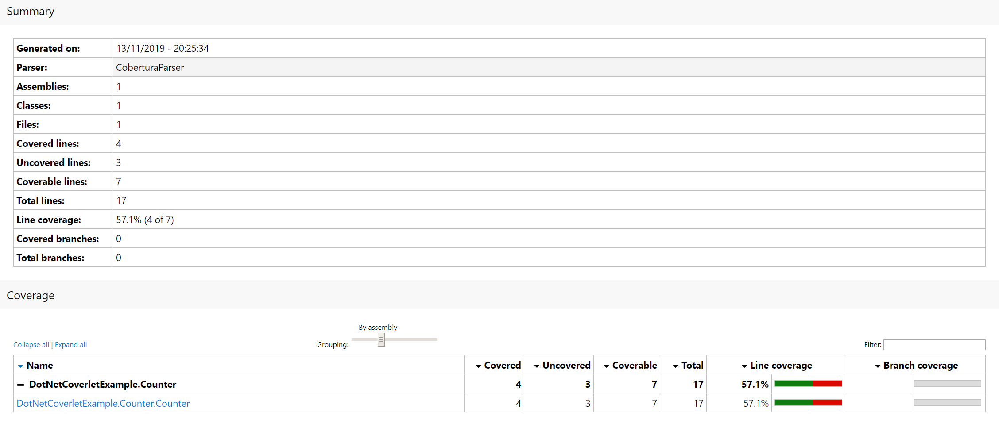
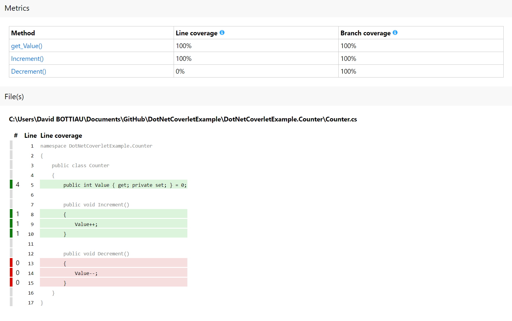

# Example of coverlet with .NET Core/.NET Standard

### With xUnit

1. First, collect code coverage from unit tests.

```
dotnet test --collect:"XPlat Code Coverage" 
```

2. If you haven't already, be sure to have the `reportgenerator` cli tool installed on your computer. If not, here is the command:

```
dotnet tool install -g dotnet-reportgenerator-globaltool   
```

3. Then create your report using the `reportgenerator` cli tool

The common report types are xml-based `Cobertura`.

```
reportgenerator -reports:coverage.cobertura.xml -targetdir:coverlet/reports -reporttypes:"Cobertura"
```

You can also create a HTML report to have a better view of your code coverage results.

```
reportgenerator -reports:coverage.cobertura.xml -targetdir:coverlet/reports -reporttypes:HtmlInline_AzurePipelines
```

Here I used the `HtmlInline_AzurePipelines` report type but you can surely use your own based on your needs. 
Here is a list of what you can use: https://danielpalme.github.io/ReportGenerator/usage.html

Look what you got now:



